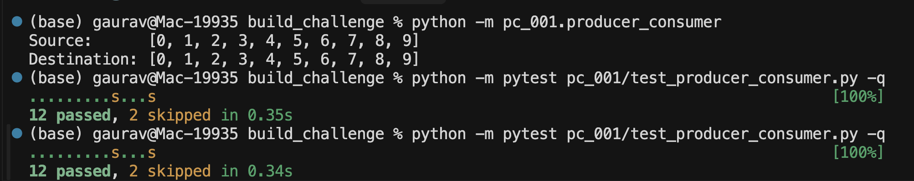
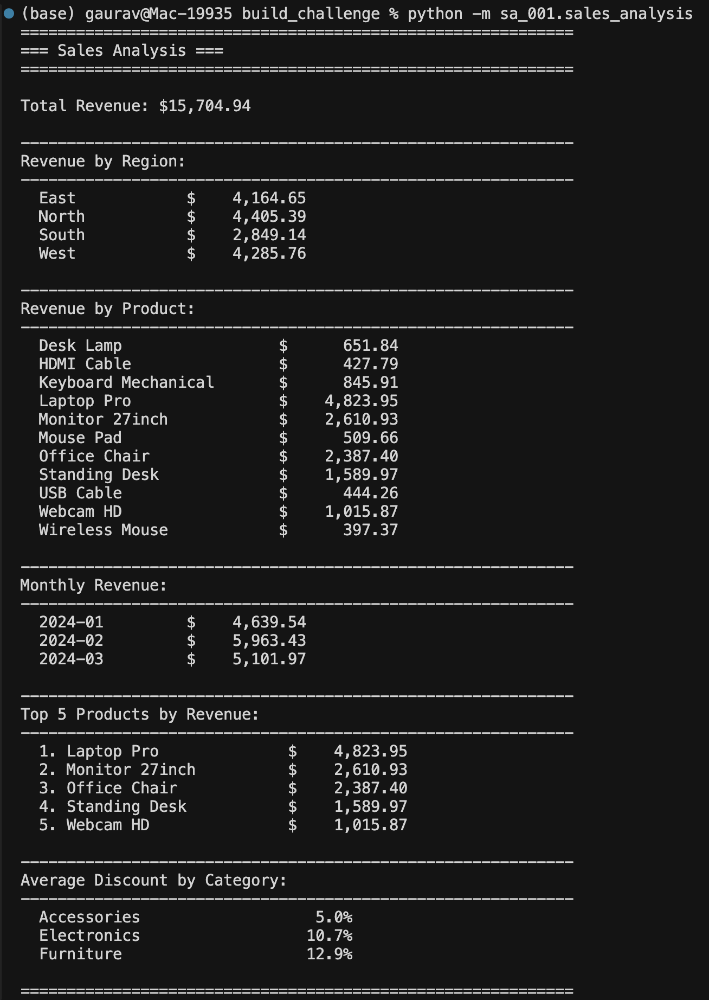
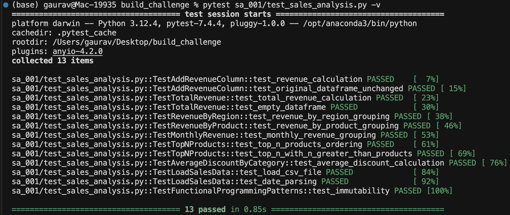
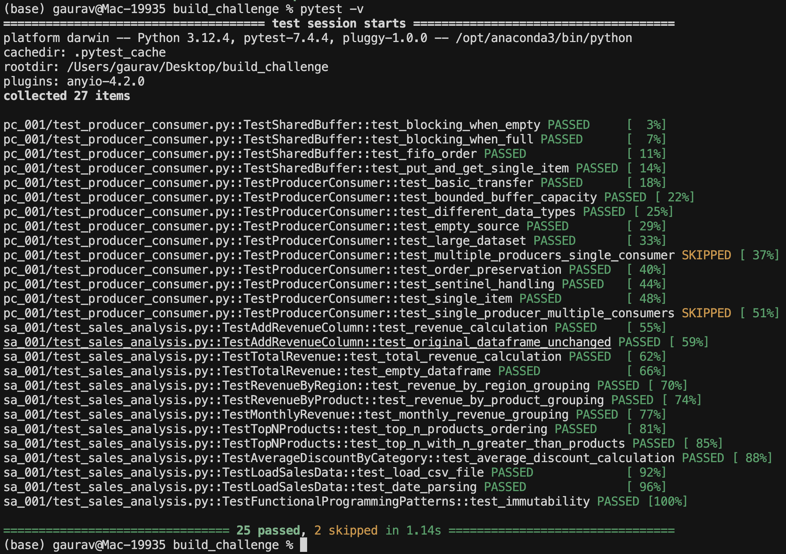

# Intuit Build Challenge

Solutions for assignments **PC-001 (Producer-Consumer)** and **SA-001 (Sales Analysis)** implemented in Python.

## Setup Instructions

```bash
git clone https://github.com/gavksingh/intuit-build-challenge.git
cd intuit-build-challenge
pip install -r requirements.txt
```

**Run demos:**
```bash
python -m pc_001.producer_consumer
python -m sa_001.sales_analysis
```

**Run tests:**
```bash
pytest pc_001/test_producer_consumer.py -v  # 12 passed, 2 skipped
pytest sa_001/test_sales_analysis.py -v     # 13 passed
pytest -v                                    # All tests: 25 passed, 2 skipped
```

---
## Project Structure

```
intuit-build-challenge/
├── pc_001/
│   ├── producer_consumer.py    # Producer-Consumer implementation
│   └── test_producer_consumer.py
├── sa_001/
│   ├── sales_analysis.py       # Sales analysis implementation
│   ├── test_sales_analysis.py
│   └── data/
│       └── sales_sample.csv
├── terminal_outputs/
│   ├── assignment1_output1.png
│   ├── assignment2_output1.png
│   ├── assignment2_output2.png
│   └── assignment2_output3.png
├── requirements.txt
└── README.md
```
---

## PC-001: Producer-Consumer Pattern

### Overview

Classic producer-consumer pattern with thread synchronization using `threading.Condition` for wait/notify mechanism. Implements bounded blocking queue with producer and consumer threads.

### Implementation Highlights

| Feature | Details |
|---------|---------|
| **Synchronization** | `threading.Condition` guards blocking `put()`/`get()` on bounded `deque` buffer |
| **Shutdown** | Unique sentinel (`object()`) allows real `None` payloads and clean thread termination |
| **Threads** | `Producer` and `Consumer` extend `Thread`, maintain FIFO ordering |
| **Components** | `SharedBuffer`, `Producer`, `Consumer` in `pc_001/producer_consumer.py` |
| **Testing** | 12 tests covering blocking behavior, ordering, sentinel handling, edge cases |

### Sample Output

```
Source:      [0, 1, 2, 3, 4, 5, 6, 7, 8, 9]
Destination: [0, 1, 2, 3, 4, 5, 6, 7, 8, 9]
```

**Terminal Output - PC-001 Demo Run & Test Results:**



*Screenshot showing: (1) Successful producer-consumer execution (`python -m pc_001.producer_consumer`) with matching source and destination arrays demonstrating thread-safe data transfer, (2) Test execution (`pytest pc_001/test_producer_consumer.py -q`) with 12 passed and 2 skipped tests in 0.35s.*

### Testing Objectives Met ✅

- ✅ Thread synchronization with `Condition.wait()` and `notify_all()`
- ✅ Concurrent programming with multiple threads
- ✅ Blocking queues with bounded buffer
- ✅ Wait/Notify mechanism for thread coordination

---

## SA-001: Sales Analysis

### Overview

Data analysis application using pandas with functional programming patterns (lambda expressions, method chaining, groupby operations). Performs aggregations on sales data from CSV.

### Implementation Highlights

| Feature | Details |
|---------|---------|
| **Data Source** | `sa_001/data/sales_sample.csv` (25 rows, 3 months, 4 regions, 11 products, 3 categories) |
| **Functional Style** | Heavy use of pandas method chaining, `.assign()` with lambdas, immutable operations |
| **Aggregations** | Total revenue, region/product splits, monthly rollups, top-N products, category averages |
| **Functions** | `load_sales_data()`, `add_revenue_column()`, `total_revenue()`, `revenue_by_region()`, `revenue_by_product()`, `monthly_revenue()`, `top_n_products_by_revenue()`, `average_discount_by_category()` |
| **Output** | `print_analysis()` with formatted currency and percentage display |
| **Testing** | 13 tests validating calculations, immutability, aggregations, CSV loading, date parsing |

### Sample Output

**Terminal Output - SA-001 Analysis Results:**



*Screenshot 1: Complete sales analysis execution (`python -m sa_001.sales_analysis`) showing all aggregations: total revenue ($15,704.94), revenue by region (4 regions), revenue by product (11 products), monthly revenue (3 months), top 5 products, and average discount by category with formatted currency and percentage display.*



*Screenshot 2: SA-001 test results (`pytest sa_001/test_sales_analysis.py -v`) showing all 13 tests passed in 0.85s, covering revenue calculations, immutability, aggregations, CSV loading, and functional programming patterns.*



*Screenshot 3: Complete test suite execution (`pytest -v`) showing all tests for both assignments: PC-001 (12 passed, 2 skipped) and SA-001 (13 passed), totaling 25 passed and 2 skipped in 1.14s, demonstrating comprehensive test coverage.*


### Testing Objectives Met ✅

- ✅ Functional programming with lambda expressions and method chaining
- ✅ Stream operations using pandas groupby, map, filter, aggregate
- ✅ Data aggregation with sum, mean, count operations
- ✅ Lambda expressions in `.assign()` and transformations

---

## Requirements Coverage Summary

**PC-001**: Thread synchronization ✅ | Concurrent programming ✅ | Blocking queues ✅ | Wait/Notify ✅

**SA-001**: Functional programming ✅ | Stream operations ✅ | Data aggregation ✅ | Lambda expressions ✅

**Deliverables**: Public repository ✅ | Source code ✅ | Unit tests ✅ | README with setup ✅ | Sample output ✅


---

## License

This project is part of the Intuit Build Challenge.
